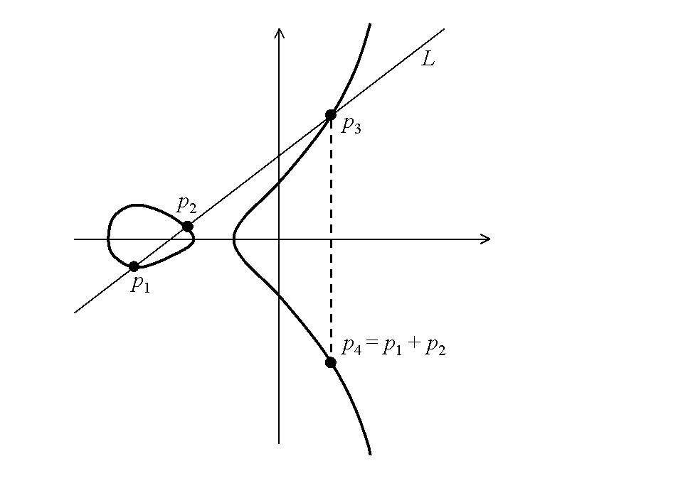

% `ec`: A Haskell Elliptic-Curve Cryptography Library 
% Created by Brandon Azad and Nikhil Desai

# Intro
* A new library for ECC.
* Advantages:
    * Modular
    * Cleanly implemented
    * Readily extensible
* Provides performant implementations while retaining flexibility

# Motivation
* Cryptography research: creating new _schemes_ for encryption/authentication
    * Innovative mixing and matching of different primitives
    * Making incremental improvements to existing ones
    * Collaboration/extensibility necessary
* Don't want researchers to reinvent the wheel
    * Want a clean, easily-utilized framework for testing
    * Inspired by Cryptol
* Existing libraries kind of suck

# Why Haskell?
* Clean specifications possible without sacrificing performance
* Good for mathematical abstraction
* Thanks to this class, we can do cool things with Haskell! 

# Language of ECC
* **Elliptic curves**: defined by equation of form $y^2=x^3+ax^2+b$ 
* Points endowed with **group structure.**

# ElGamal encryption 
* Elliptic curve groups well-suited for **ElGamal encryption.**
* Prerequisite: group $G$ of prime order $p$ 
* Asymmetric key exchange: $g\in G$ public, $\alpha\in\mathbb{Z}_p$ private, $h=g^{\alpha}$ public
* To encrypt $m\in G$:
    * Pick random $r\leftarrow\mathbb{Z}_p$
    * Send $(g^r, h^rm)$ 
* To decrypt $(x, y)$ 
    * Compute $m = x^{-\alpha}y$ 
* Need fast exponentiation and inversion, but...
* Need to keep discrete log - finding $\alpha$ given $g^{\alpha}$ - *hard*.

# Language of ECC
* Canonical formula for point addition
$$x_R=\left(\frac{y_P-y_Q}{x_P-x_Q}\right)^2-x_P-x_Q;$$ $$y_R=\left(\frac{y_P-y_Q}{x_P-x_Q}\right)(x_P-x_R)-y_P.$$ 

* Elliptic curves can be defined over any field 

# Elliptic curves over finite fields
* Typically defined over *finite* fields: $\mathbb{Z}_p$ (integers mod $p$), $\mathbb{Z}_{2^k}$ (field of size $2^k$) 
    * Finite representations of points 
    * Discrete-log problem hard

# Library design 
* Key typeclasses
    * `Field`
    * `EllipticCurvePoint` (multi-parameter)
    * `EllipticCurve`  (multi-parameter)

# The `Field` typeclass
~~~~ {#mycode .haskell }
class (Eq f) => Field f where
  type FieldParameter f
  zero :: f
  one  :: f
  add  :: FieldParameter f -> f -> f -> f
  neg  :: FieldParameter f -> f -> f
  rep  :: FieldParameter f -> Integer -> f -> f
  mul  :: FieldParameter f -> f -> f -> f
  sqr  :: FieldParameter f -> f -> f 
  inv  :: FieldParameter f -> f -> f
  pow  :: FieldParameter f -> f -> Integer -> f
~~~~~~~~~~~~~~~~~~~~~~~~~~~~~~~~~~~~~~~~~~~~~~~~~

# `FieldOperations f`
~~~~ {#mycode .haskell} 
data FieldOperations f = FieldOperations
  { (+)  :: f -> f -> f       
  , (.-) :: f -> f          
  , (-)  :: f -> f -> f     
  , (#)  :: Integer -> f -> f
  , (*)  :: f -> f -> f
  , (^.) :: f -> f
  , (./) :: f -> f
  , (/)  :: f -> f -> f
  , (^)  :: f -> Integer -> f
  }

ops :: (Field f) => FieldParameter f -> FieldOperations f
ops p = FieldOperations (add p) (neg p) (sub p) (rep p)
                        (mul p) (sqr p) (inv p) (div p) (pow p)
~~~~~~~~~~~

# Field definition: integers mod $p$ 
~~~~ {#mycode .haskell}
instance (KnownNat n) => Field (Integer `Mod` n) where

  type FieldParameter (Integer `Mod` n) = ()

  zero = 0
  one = 1
  add _ = (+)
  neg _ = negate
  sub _ = (-)
  rep _ n a = fromInteger n * a
  mul _ = (*)
  inv _ a = toMod $ 
      invm' (natVal (Proxy :: Proxy n)) (unMod a)
~~~~~~~

# The `EllipticCurvePoint` type relation
~~~~ {#mycode .haskell}
class EllipticCurvePoint c p where
  toAffine    :: (Field f) => EC c f -> p c f -> Affine c f
  fromAffine  :: (Field f) => EC c f -> Affine c f -> p c f
  zeroPoint   :: (Field f) => EC c f -> p c f
  isZeroPoint :: (Field f) => EC c f -> p c f -> Bool
  affineXY    :: (Field f) => EC c f -> p c f -> Maybe (f, f)

data Affine (c :: * -> *) f = Affine { affineX, affineY :: f } | AffinePointAtInfinity
~~~~~~ 

# The `EllipticCurve` type relation
~~~~ {#mycode .haskell}
class (EllipticCurvePoint c p) => EllipticCurve c p where
  onCurve  :: (Field f) => EC c f -> p c f -> Bool
  add      :: (Field f) => EC c f -> p c f -> p c f -> p c f
  double   :: (Field f) => EC c f -> p c f -> p c f
  negate   :: (Field f) => EC c f -> p c f -> p c f
  multiply :: (Field f) => EC c f -> Int -> Integer -> p c f -> p c f
~~~~~~ 

# Curve definition: Weierstrass with Jacobian points 
~~~~ {#mycode .haskell}
data Weierstrass f = Weierstrass { weierstrassA, weierstrassB :: f }

instance EllipticCurvePoint Weierstrass Jacobian where
  toAffine (EC _ FieldOperations {..}) (Jacobian x y z)
    | z == zero = AffinePointAtInfinity
    | otherwise =
      let iz3 = (./) (z ^ 3)
      in Affine (x * iz3 * z) (y * iz3)

  fromAffine _ (Affine x y)          = Jacobian x   y   one
  fromAffine _ AffinePointAtInfinity = Jacobian one one zero

instance EllipticCurve Weierstrass Jacobian where
  onCurve (EC (Weierstrass a b) FieldOperations {..}) (Jacobian x y z) =
    let z2 = z^2
        z4 = z2^2
        z6 = z2 * z4
    in y^2 == (x^3) + (a * x * z4) + (b * z6)

  add c@(EC _ FieldOperations {..})
      p1@(Jacobian x1 y1 z1) p2@(Jacobian x2 y2 z2)
    | z1 == zero = p3 `seq` p2
    | z2 == zero = p3 `seq` p1
    | otherwise  = p3 `seq` p3
    where
      p3 = jacobianAdd c x1 y1 z1 x2 y2 z2

  double c@(EC _ FieldOperations {..}) p@(Jacobian x1 y1 z1) = jacobianDouble' c x1 y1 z1 (z1^2)

  negate c@(EC _ FieldOperations {..}) p@(Jacobian x1 y1 z1) = Jacobian x1 ((.-) y1) z1
~~~~~~~~

# Optimization/efficiency 
* "Pluggable" library - insert your own code for timing resistance, efficiency

~~~~ {#mycode .haskell}
instance Field P521  
  {- ... -}
  pow :: FieldParameter P521 -> P521 -> Integer -> P521 
  pow p = montgomery (mul p) (sqr p) (inv p) (one) 521 

montgomery :: (a -> a -> a) -> (a -> a) -> (a -> a) -> a -> Int -> a -> Integer -> a
montgomery mul sqr inv id n a d = gpow montgomery' inv id a d
  where
    montgomery' a d = go id a n
      where
        go !r0 !r1 !n
          | n == -1     = r0
          | testBit d n = go (r0 `mul` r1) (sqr r1)      (n - 1)
          | otherwise   = go (sqr r0)      (r0 `mul` r1) (n - 1)
~~~~~~

# "Interfacing" with OpenSSL
~~~~ {#mycode .haskell} 
foreign import ccall unsafe "p521.h felem_neg"
  c_felem_neg :: Dst Felem -> Felem -> IO ()

call1 :: (Dst Felem -> Felem -> IO ()) -> P521 -> P521
call1 fun (P521 p) = unsafePerformIO $ do
  withForeignPtr p $ \felem -> do
    make (\dst -> fun dst felem)

neg :: P521 -> P521
neg = call1 c_felem_neg
~~~~~~~
~~~~ {#mycode .c}
void felem_neg(felem out, const felem in)
{
    /* In order to prevent underflow, we subtract from 0 mod p. */
    static const limb two62m3 = (((limb)1) << 62) - (((limb)1) << 5);
    static const limb two62m2 = (((limb)1) << 62) - (((limb)1) << 4);

    out[0] = two62m3 - in[0];
    out[1] = two62m2 - in[1];
    out[2] = two62m2 - in[2];
    out[3] = two62m2 - in[3];
    out[4] = two62m2 - in[4];
    out[5] = two62m2 - in[5];
    out[6] = two62m2 - in[6];
    out[7] = two62m2 - in[7];
    out[8] = two62m2 - in[8];
}
~~~~~~ 

# Future work 
* Point counting for arbitrary curves (useful for e.g. primality proving) 
* Pairing (using bilinear maps for multi-party key exchange) 
* Working with `Crypto.PubKey.Types` and other "front-end" type libraries
* Further improvements to timing attack resistance and efficiency
